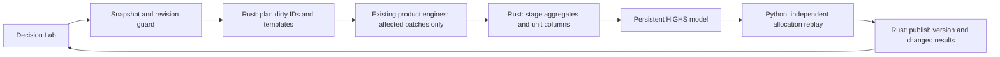

# End-to-end Rust decision prototype: implementation and comparison

28 September 2026 · engine **0.21.0** · local prototype on Windows

The complete interactive workflow is implemented: **temporary assumption edit →
selective product pricing → portfolio/strategy coefficient updates → robust
optimization → independent allocation replay → versioned publication**.
Open **Decision Lab** from the workspace rail after building the native library.

This expands the earlier discount-kernel experiment into a Rust-owned decision
runtime. Product models and simulations remain in Python/Numba; HiGHS remains a
C++ solver. It is a working hybrid prototype, not a completed full Rust rewrite.
The existing What-if, Strategy Lab, Optimizer and forecast workflows remain available.

## What is implemented

| Capability | Implementation and behavior |
|---|---|
| Session lifecycle | Immutable pricing context; bounded process-local sessions; explicit close; stale/idle eviction on subsequent builds |
| Instrument dependency updates | Rust indexes stable instrument IDs and merges temporary patches; Python gathers only affected rows, without scanning the entire book |
| Five product books | MBS/whole loans, corporate loans, debt, non-maturity deposits and CDs; unchanged auxiliary MM/hedges contribute to the initial balance sheet |
| Calibration discipline | Original base OAS and accounting anchors are held; shared random numbers and existing product kernels remain authoritative |
| Demand-based computation | Decision pricing asks for spot, parallel DV01 and NII; unused ten-pillar KRD bumps are omitted. Full-risk callers retain their existing defaults |
| Portfolio aggregates | Rust applies per-scenario signed MV/DV01/NII, agency L2A and asset-MV deltas; final CET1 reflects retained income |
| Strategy coefficients | All seven templates; spread edits rebuild only the selected templates across session scenarios |
| Optimization | Persistent native HiGHS model; update row bounds/coefficients when layout is unchanged; rebuild when row layout changes |
| Objective and constraints | Maximize worst-case base-plus-overlay NII; monthly LCR with both L2A-cap branches, NSFR, two-sided EVE, funding; horizon CET1; asset and commercial bounds |
| Manual allocation replay | Synchronous Rust evaluation of stored coefficients, without pricing or solving; supported purchase-month grid only |
| Publication | Plan/stage/publish transaction; independent Python aggregate and allocation checks; saved-input revision guard; no partial publication |
| Failure semantics | Stale versions rejected; invalid edits rolled back; solver limits/errors abort; infeasibility returns no allocation and is not labeled “validated” |
| UI | Build session, select scenarios, edit targets/instrument fields/template spreads, optimize, inspect allocation/constraints, and replay scaled allocations |



Each native session owns a solver actor thread. Solver pointers never migrate
between threads; there is no unsafe `Send` implementation. The API retains its
single quant worker so product kernels do not compete for all CPU cores. Native
HiGHS is configured for one solver thread. Independent native sessions are tested
concurrently, but the API is deliberately still a single-worker local service.

## Measured complete-workflow performance

Fixture: **375 real synthetic-book positions, three markets (base and ±25 bp),
128 paths, four Numba threads, 27 months, 35 strategy units per market**, with
money-market and hedge contributions. Windows 11, Intel family 6/model 183,
Python 3.12.11. Existing Numba disk caches may be warm. No competing benchmark
workloads were run during these measurements.

| Operation | Median | Maximum | Actual work |
|---|---:|---:|---|
| Session initialization + first solve | 2,759.57 ms | one observation | Full pricing, units and native initialization |
| Constraint update through validated publication | **6.81 ms** | 7.84 ms | Zero positions priced; zero templates rebuilt |
| One instrument assumption edit through validated publication | **21.46 ms** | 23.11 ms | One position; three cashflow/mark legs per market; no new OAS solve |
| One template spread edit through validated publication | **729.52 ms** | 734.79 ms | One template across three markets; zero backbook positions |
| Native allocation replay, including JSON ABI | **0.291 ms** | 0.373 ms | Stored coefficients, three scenarios |
| Python allocation replay on the same coefficients | **0.248 ms** | 0.524 ms | Stored coefficients, three scenarios |
| Complete fresh Python pricing + full unit libraries + SciPy solve | **4,501.31 ms** | 4,507.92 ms | Entire baseline workflow rebuilt, same requested analytics |

Update samples: five each; replay: thirty each; full rebuild: three. Initialization
is not a cold toolchain/JIT measurement. These are local observations, not p95
estimates or production latency guarantees. The full rebuild uses the same pricing
and unit-library conventions as the prototype, shares its fresh pricing cache
across scenario builds, and compares to the initial baseline;
it is not a direct timing of the older `/optimize` adapter with its different base
driver structure.

### Separating reuse, computation selection, and language

The largest gains come from avoiding work. They must not be attributed entirely
to Rust. An equally selective Python orchestration design could avoid much of the
same work; this experiment does not implement that alternative graph for an
otherwise identical language-only comparison.

On the **same already-built coefficients**, a fresh SciPy model/solve/replay takes
**10.34 ms**, versus **6.95 ms** for the persistent native transaction, including
independent Python validation. This is approximately **1.49×**, not an orders-of-
magnitude language gain. It also combines differences in model retention,
matrix construction, scaling, HiGHS packaging and solver configuration. Repeated
unchanged native solves retained the model and required zero simplex iterations.
Native and SciPy objectives differed by only **$0.0000002384** in the final fixture;
their initial full-rebuild objectives matched exactly. Degenerate allocations
are compared by objective and feasibility, not by identical weights.

The final optimization removed KRD calculations that this LP never consumes:

| Same three-market decision workflow | Before pruning | Final |
|---|---:|---:|
| One instrument edit | 81.56 ms | 21.46 ms |
| Initialization + first solve | 13,707.73 ms | 2,759.57 ms |
| Retained pricing-cache accounting | 512.00 MiB | 71.31 MiB |
| Cashflow legs for the edited loan per market | 23 | 3 |

The pre-pruning cache reached its configured limit. Reported cache bytes exclude
transient arrays, input frames, JSON buffers, Python allocator overhead and native
solver storage; **71.31 MiB is not total process memory**. Template rebuilds still
perform market/path setup in their own run context; finer reuse there is a concrete
next optimization opportunity.

### User-visible browser latency

Actual local API and browser, **one base market**, 375 positions, 128 paths,
four threads and 27 months. Browser clock measures the Apply click through the
new version appearing plus two animation frames. Includes job polling (75 ms),
HTTP, Arrow-envelope decoding and rendering.

| Browser operation | Median | Maximum |
|---|---:|---:|
| Initial build | 1,789.90 ms | one observation |
| Constraint edit | **67.70 ms** | 73.40 ms |
| Instrument edit | **155.40 ms** | 173.70 ms |
| Template spread edit | **353.00 ms** | 360.50 ms |

Five constraint/instrument samples and three template samples; 14 captured job
results, zero page errors. Browser timings are not directly comparable to the
three-market engine table. Screenshots: [desktop](decision-desktop.png),
[allocation and replay](decision-results.png), [narrow workspace](decision-narrow.png).

### Large dependency graph probe

**100,000 synthetic precomputed contribution records**, with the same three
scenario/unit coefficient sets: native initialization **963.11 ms**; one-record
plan/update/solve/publish **2.53 ms median**, **3.78 ms max** across thirty samples.
Average update request payload was **334 bytes**. The graph updates one record
without transferring/scanning the full book after initialization.

This probe does **not** price 100,000 instruments, call product kernels, run the
Python independent-validation gate, or traverse HTTP/UI. It demonstrates graph
and solver-state behavior at that record count. Large-portfolio pricing, memory
pressure, simultaneous-user capacity and production tail latency remain unproven.

## Validation and review

- **95 engine tests passed**, including ten native-decision integration cases.
- **55 API tests passed**, including real session jobs, cheap constraint updates,
  stale versions and rejection when saved inputs change during publication.
- **14 browser tests passed**; the new real workflow and stale-response tests were
  rerun after the final changes. Existing forecast/What-if/Strategy Lab tests pass.
- **4 Rust decision tests passed**: transaction/reuse/rollback, invalid shapes,
  malformed ABI input/numerical overflow, and simultaneous actor lifecycle.
- TypeScript and production web build pass. Rust formatting and Clippy with
  warnings denied pass. Lockfiles check; skill validation and packaging pass.
- The optional native library was built and exercised; native tests were not
  silently replaced by a Python fallback or skipped in this validation.

The numerical gates compare all five book edits against full-portfolio repricing,
four product-family selective template builds against full libraries, and native
allocations against the independent Python evaluator and SciPy optimizer. Failure
injection checks that candidate validation or revision failure leaves the old
version and aggregates intact. Resetting an override restores saved assumptions.
Constraint-only tests replace product functions with failures to prove they are
not called. Published base totals are also independently compared.

Existing warnings remain: FastAPI startup/TestClient deprecations and Vite's
large entry-chunk warning. The new Decision Lab is lazy-loaded (about 11.7 kB
uncompressed). No deployment or production-data validation is claimed.

## Model coverage and remaining scaling work

| Area | Current prototype | Further work for the anticipated scale |
|---|---|---|
| Product pricing | Existing vectorized Python/Numba models behind batches | Profile complete products before porting; preserve fixed-OAS, CRN and accounting golden cases |
| Risk | Spot and parallel DV01 feed decisions; full KRD/vega/stress exist separately | Bring requested risk measures and stress/vega coefficients into the graph with explicit dependencies |
| Strategy | Seven unit templates, purchase grid, linear scaling, robust LP, manual replay | Dynamic reinvestment, business-volume feedback, multi-period policy decisions and nonlinear economics |
| Forecasts | Existing conditional NII workflow remains separate | Joint objective/risk contract for forecast income versus pricing measures; never price EVE with conditioned forecast paths |
| Solver | Continuous robust linear program with duals | Integer trade/lot constraints, turnover/transaction costs, nonlinear objectives, lexicographic objectives, feasibility relaxation and richer infeasibility explanations |
| Runtime | Bounded local actors and one API quant worker | Admission by memory/CPU cost, cancellation, worker isolation, retries, durable jobs and distributed partitioning |
| Data movement | Whole snapshot once, small copied JSON deltas afterwards | Typed binary/Arrow batches, larger initialization budgets, compression/streaming and ownership across processes |
| Reproducibility | Context fingerprint including DLL hash, seed/settings, revision and tested replay | Durable event history, model/source lineage, reproducible build artifacts and long-running drift/reconciliation checks |
| Governance | Current local application's trust model | Tenant authorization, entitlements, audit retention and immutable approved decisions |
| Execution | Analytics only | Order generation, limits, approval workflow, reconciliation and execution-system integration |

Known financial approximations are inherited deliberately: deterministic forward
coupons, time-shifted cohorts, linear interpolation between purchase grid points,
balance-scaled forward DV01, static base regulatory weights/RWA, and NII-only
capital retention. Deposit template spread shifts the starting paid rate, not a
fully recalibrated deposit franchise model. Scenario selection fixes the market
set for the session; saved curve/volatility/book/assumption/runtime edits rebuild
it. Frozen global prepayment parameters still require a process restart.

LP template/scenario credit-spread conventions follow the existing unit-library
optimizer: scenario spread shocks apply to backbook security OAS; new-business
spreads come from template assumptions. Auxiliary MM/hedges use their existing
drivers and are not individually editable in this graph. Hard cancellation of
running product kernels is not implemented; closing/invalidating a session stops
publication but does not guarantee immediate compute interruption.

The native caps are 8 sessions, 200k records, 10k edits/request, 1,024 units,
13 scenarios, 120 months, a 128 MiB JSON request and a 15-second solve. API sessions
are capped at four and have stale/30-minute-idle cleanup on new builds. Sessions
are in-memory and lost on process restart. These are prototype admission limits,
not demonstrated production capacity or an aggregate memory cap.

## Where the Rust rewrite now makes sense

The decision runtime is a useful Rust boundary: it owns long-lived state,
dependency updates, stable coefficient buffers and the solver lifecycle. The
prototype proves that boundary can serve the complete user workflow while keeping
independent model checks. It supports proceeding with a Rust decision service if
the roadmap requires larger dependency graphs, tighter resource ownership and
more concurrent sessions.

It does not establish a performance case for rewriting every product kernel, the
research workflow, the API or the UI. The next evidence should be an actual large
mixed-book workload with memory/concurrency limits and representative strategy
constraints. Port the dominant product kernel only after profiling that workload.
Keep Python as a model-validation/research interface; keep mature external solver
engines behind a narrow adapter unless their algorithms themselves become the
bottleneck.

## Files and reproduction

- Native state/solver: `packages/portfolio-decision-native/src/{lib,solver}.rs`.
- Engine bridge: `packages/portfolio-risk/src/portfolio_risk/strategy/decision.py`.
- Selective library build: `strategy/unitlib.py`; requested analytics:
  `analytics/incremental.py`.
- API: `apps/api/app/decision_store.py`, schemas and `/decision/sessions` routes.
- UI: `apps/web/src/pages/DecisionLab.tsx`.
- Raw [engine measurements](2026-09-28-decision-prototype.json),
  [before-pruning measurements](2026-09-28-decision-before-pruning.json),
  [browser measurements](2026-09-28-decision-browser.json).

```powershell
# From the repository root. C++ Build Tools are required on Windows.
uv run --project apps/api --with libclang --with cmake python scripts/build_decision_native.py
uv run --project apps/api --with libclang --with cmake python scripts/build_decision_native.py --test
uv run --project apps/api --with libclang --with cmake python scripts/build_decision_native.py --clippy
uv run --project apps/api python -m pytest packages/portfolio-risk/tests -q
uv run --project apps/api python scripts/benchmark_decision.py

# From apps/api:
uv run python -m pytest tests -q

# From apps/web (tests launch disposable services on 8001/5174):
bunx playwright test
bun run build
# With those disposable services already running:
node scripts/measure-decision.mjs
```

Stop processes using the native DLL before rebuilding it on Windows. The build
helper supplies isolated CMake/libclang; it does not replace system toolchains.
HiGHS Rust wrapper 2.4.0, highs-sys 1.15.0, Serde 1.0.228 and serde_json 1.0.151
are pinned in the native manifest/lockfile. The library is optional for existing
application paths and required for Decision Lab; unavailable native support is
an explicit error, never a silent fallback.
