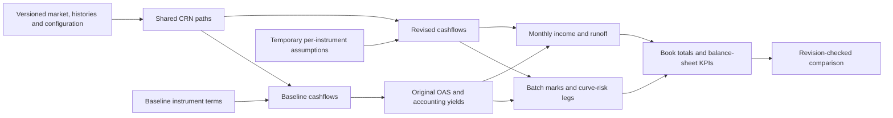

# Five-step implementation and backend comparison

**Follow-up:** the wider Rust-owned decision workflow is implemented and measured
in [the end-to-end decision prototype report](2026-09-28-decision-prototype.md).
This document retains the earlier discount-kernel comparison and its narrower scope.

**Date:** 28 September 2026 · **Engine:** 0.20.0 · **Status:** all five implementation steps completed and locally validated.

## Decision

**Keep the existing product models and Python dependency layer. Use incremental
recalculation now; keep Rust as an optional, replaceable numerical backend.**

The measured benefit comes primarily from avoiding unnecessary calculations.
A single spread edit on the 375-position mixed book takes **8.05 ms** versus
**196.12 ms** for a fresh graph rebuild, approximately **24.4× faster**. It
computes exactly one new mark node and preserves original OAS.

The Rust pilot is real: a compiled library is called through the Python ABI,
used by the graph and API, and checked against NumPy and Numba. It does not
provide a material application-level advantage here. At 100,000 instruments,
the prepared discounting call takes **76.60 ms in NumPy, 6.69 ms in fused Numba,
and 17.11 ms in Rust**. Once packing is included, those times become **153.64,
89.51 and 94.40 ms**. For the actual mixed-book analytics API, all three paths
take approximately **260 ms**.

**No evidence from this pilot justifies a wholesale Rust rewrite.** Rust remains
an architectural option if independent deployment, stronger native ownership,
or a broader port of simulation and product kernels becomes a requirement.
This experiment does not measure a Rust-owned graph or Rust product models.

## 1. Delivery against the five steps

| Step | Delivered behavior | Validation |
|---|---|---|
| Temporary instrument assumptions | Validated per-ID overrides for mortgages, loans, debt, deposits and CDs; immutable saved books; original OAS held; explicit comparison-only recalibration | Saved-input checks, independent target repricing, invalid-field/domain rejection, selective invalidation |
| User workflow | Instrument What-if panel; original/revised prices and net values; affected book totals; temporary changes, spread shifts, scope selection, reset and recalibration; obsolete results hidden | Real browser jobs, saved-book byte equality, delayed-response race test, narrow-panel checks and visual inspection |
| Incremental analytics | Parallel DV01, ten KRD01 pillars, monthly NII, runoff, EVE, LCR, NSFR and CET1; auxiliary money markets and hedges in full-scope analytics | Existing independent NII/DV01/KRD/KPI drivers, rebuild parity, empty scope, baseline yields and auxiliary books |
| Realistic scale and pressure tests | 375 mixed positions; 10k/100k corporate loans; repeated spread and coupon edits; 10k-name +100bp market shock; forced cache eviction; process memory and allocation observations | Reproducible raw samples, computed-node counts, exact rebuild comparisons and explicit cache bounds |
| Rust backend pilot | Optional application-owned CSR reduction in a pinned/locked Rayon library; real C ABI; NumPy and fused Numba controls; backend-specific cache identity | Native tests, Rust lint/format checks, ragged signed-flow parity, 1/4-thread determinism, actual HTTP/Arrow runs, no-fallback errors |

These are local implementation and validation results on synthetic positions.
They are not production market-data calibration or independent economic model
certification. No upstream OSS fixes, external publication or deployment was performed.

## 2. Calculation architecture and semantics



- Content-addressed immutable nodes encode their parents. Keys include model
  identity, valuation date, histories, market, seed/path counts, resolved
  assumptions and calibration inputs. Rust marks also include the binary hash.
- One spread edit changes only its mark. One coupon edit with analytics changes
  that instrument's **23 cashflow nodes, 23 mark nodes and one income node**:
  spot plus 22 curve-risk legs. Paths, original calibration and other positions
  are reused when the working set fits the cache.
- A broad market shock changes shared paths and every affected instrument's
  valuation cashflows. It still holds original OAS. Saved book/base-market edits
  create new calibration inputs; temporary edits do not silently rebase.
- Explicit recalibration refits revised contracts to their saved target prices
  for the comparison. Persisting contract edits remains a Book Editor action.
- Shared CRN, the existing shifted LMM and A-matrix factorization are retained.
  No path × instrument × month tensor is introduced. Cashflow generation stays
  outside OAS iterations.
- Parallel DV01 uses the existing balance-sheet **±25bp** convention; KRD01
  uses the risk desk's **±1bp** convention. Both report dollars per basis point.
  A parallel sensitivity need not equal the sum of individually bumped pillars
  exactly for nonlinear products.
- NII freezes baseline effective yields and rolls revised expected cashflows.
  This preserves the existing static-yield accounting approximation; it does not
  implement retrospective yield resets. CDs/deposits use contractual accrual.
  A spread-only valuation overlay does not change contractual NII.
- Named scenarios in this panel use the first-quarter shock as the starting
  market. This is not the separate nine-quarter path/stress workflow.
- The top net-value cards cover the five supported pricing books. Full-scope
  risk/earnings KPIs add existing money-market/hedge drivers. Existing EVE
  aggregation includes hedge sensitivity but does not add a separate hedge fair
  value balance; this inherited approximation remains explicit.
- The synchronous Strategy Lab path remains separate and receives no pricer
  calls from this implementation. Longer comparisons use the single quant worker.

## 3. What the backend comparison actually measures

| Boundary | NumPy | Fused Numba | Rust pilot |
|---|---|---|---|
| Product schedules, behavior and paths | Existing Python/Numba engine | Same | Same |
| Graph and calibration | Python | Python | Python |
| Discount reduction | NumPy exponential/repeat/reduce arrays | Compiled per-instrument loops | Compiled per-instrument loops, Rayon for larger batches |
| Input representation | Immutable CSR buffers | Same | Same borrowed buffers |
| Python/native boundary | NumPy calls | Numba dispatcher | Synchronous ctypes C ABI |
| Native input copies | NumPy temporaries | OAS request copy | OAS request copy; native borrows prepared cashflow arrays |
| Packaging | Existing dependencies | Existing dependency/JIT | Optional release DLL/shared library; pinned Cargo lock |
| Failure policy | Explicit invalid/nonfinite errors | Same | Explicit invalid/nonfinite/unavailable errors; no fallback |
| Default application selection | **Retained** | Optional | Optional |

Rust ABI v1 returns PV per unit original principal. Input values already contain
market-discounted cashflow path sums; the reducer applies only the OAS discount
and divides by path count. Times are years and OAS is a decimal continuous spread.
The Python adapter keeps owners alive through the call, checks shape/dtype and
uses fresh output. Native code retains no pointers and preserves within-position
reduction order. Raw-pointer lifetime/alignment/size remain the ABI caller's
contract, not something a native bounds check can prove.

Implementation references: [Rust FFI ownership guidance](https://doc.rust-lang.org/nomicon/ffi.html),
[Python ctypes calling conventions](https://docs.python.org/3/library/ctypes.html).

## 4. Measurements

Machine: Windows 11, Intel Core i7-14700, 20 physical/28 logical cores. Four
Numba/Rayon workers; NumPy reduction is not made parallel by this setting.
Python 3.12.11, NumPy 2.4.6, Numba 0.65.1, native build Rust 1.93.1. Rayon is
pinned to 1.11.0; Cargo.lock records transitive dependencies. The earlier OSS
probe used a separate Rust 1.95 toolchain for Convex; do not conflate those builds.

Warm samples, synthetic data, no CPU affinity. Small sample sets characterize
this machine/run; percentile estimates are descriptive, not an SLA. Initial
process/JIT startup is excluded from warm claims. Full graph rebuilds include
market/path/cashflow/calibration/mark work but execute in a warmed process.

### Prepared discounting and packing

Each instrument has 60 cashflows. Prepared calls include adapter validation,
output allocation and the actual Rust FFI call. Packing includes construction
and defensive immutable copies of the common CSR input. Medians in milliseconds:

| Positions / cashflows | NumPy prepared | Numba prepared | Rust prepared | NumPy pack + call | Numba pack + call | Rust pack + call |
|---|---:|---:|---:|---:|---:|---:|
| 1,000 / 60,000 | 0.275 | 0.063 | 0.195 | 0.610 | 0.696 | 0.633 |
| 10,000 / 600,000 | 7.095 | 0.575 | 1.276 | 14.482 | 7.443 | 8.913 |
| 100,000 / 6,000,000 | 76.597 | 6.687 | 17.112 | 153.641 | 89.513 | 94.397 |

Seven prepared-call samples; three packing samples. At 100k, Numba is about
11.5× faster than NumPy for the prepared reduction, Rust about 4.5×. Packing
greatly reduces the end-to-end advantage. These measurements do not include
product cashflow generation. They support keeping reusable numeric buffers
and reducing allocations before attributing gains to a programming language.

### Full dependency graph: one instrument spread edit

128 paths. Every edit below computes **one new mark node**. Five distinct
spread edits per configuration; full rebuild is one measured sample. Milliseconds:

| Book | Backend | Unchanged median | Edit median | Fresh rebuild | Rebuild / edit |
|---|---|---:|---:|---:|---:|
| 375 mixed | NumPy | 7.85 | 8.05 | 196.12 | 24.4× |
| 375 mixed | Numba | 8.03 | 8.26 | 198.44 | 24.0× |
| 375 mixed | Rust | 8.12 | 8.51 | 200.63 | 23.6× |
| 10,000 loans | NumPy | 134.34 | 128.03 | 669.29 | 5.2× |
| 10,000 loans | Numba | 130.01 | 133.85 | 673.69 | 5.0× |
| 10,000 loans | Rust | 132.25 | 133.54 | 680.89 | 5.1× |
| 100,000 loans | NumPy | 1397.70 | 1420.03 | 6751.76 | 4.8× |
| 100,000 loans | Numba | 1431.62 | 1531.19 | 7216.45 | 4.7× |
| 100,000 loans | Rust | 1307.90 | 1307.50 | 6357.80 | 4.9× |

The one-node operation is too small to explain the differences between backends
at 100k. Those requests still hash/inspect O(N) rows and materialize O(N) output.
The similar unchanged/edit times expose that overhead. The apparent Rust lead
in one 100k graph run is not evidence of a native graph speedup: the graph is
identical Python code and the single changed mark is tiny. Order/scheduler and
allocator effects remain uncontrolled.

### Incremental DV01/KRD, earnings and KPIs

375 mixed positions, 128 paths, 27-month NII, all ten curve pillars. Five different
coupon edits on one loan; comparisons include original and revised results.
This engine benchmark excludes auxiliary money-market/hedge books and HTTP.

| Backend | Initial analytics build (ms) | Edit comparison median (ms) | Sample p95 (ms) |
|---|---:|---:|---:|
| NumPy | 2901.47 | 254.29 | 267.39 |
| Numba | 2874.44 | 250.29 | 263.11 |
| Rust | 2953.80 | 267.11 | 321.45 |

Every revised comparison computes 23 loan cashflow nodes, 23 loan marks and one
income node, with no original OAS recalibration or other-product recomputation.
Full-rebuild parity is exact in the recorded output columns and NII checks.

### Broad shock and memory pressure

- **10,000 loans, +100bp parallel market shock:** 698.15 ms. One new market fit,
  one path set, 10,000 valuation cashflows and 10,000 marks; all 10,000 original
  OAS nodes reused. Exact rebuild parity, unchanged original OAS.
- **Deliberately undersized cache:** 64 KiB / 64 entries on 90 loans. The final
  request recomputed 272 nodes, took a 79.39 ms median and remained numerically
  identical. Cache retained 64 entries / 23,360 accounted bytes. Eviction degrades
  speed, not correctness.
- Retained-node accounting: approximately **7.87 MiB** for mixed spot pricing,
  **24.84 MiB** for 10k loan spot pricing, **229.31 MiB** for 100k loan spot pricing,
  and **178.63 MiB** for mixed full analytics with repeated edits.
- The API cache is now bounded at **512 MiB and 500,000 entries**. The old 128 MiB
  budget cannot retain this mixed analytics working set. Engine callers retain
  the conservative default and may configure their own budgets.
- At 100k prepared cashflows, traced temporary allocation peaks were **91.55 MiB
  NumPy, 1.526 MiB Numba and 1.530 MiB Rust**. Tracemalloc does not account for all
  native allocations, so these are not complete cross-language memory totals.
- The combined benchmark process reached a **1,659.26 MiB peak working set**.
  That is cumulative across cases/backends, not Rust-specific or a production
  steady-state estimate. Retained-node limits exclude temporary batches, frames,
  in-flight owners, other job results and allocator overhead.

### Actual HTTP and browser workflow

Loopback API, single worker, 375 positions, 128 paths, four threads. Includes
submission, queueing, 10ms polling, result serialization/transfer and Polars Arrow
decode. Full analytics includes money markets and hedges. Five distinct edits
per backend; backend-specific coupon values prevent sharing newly computed
cashflow nodes across the comparison. Each final result is checked against NumPy
on identical inputs outside timing. First calls are recorded separately and
are not comparable cold-start measurements.

| Request | NumPy median / p95 ms | Numba median / p95 ms | Rust median / p95 ms |
|---|---:|---:|---:|
| Price comparison | 29.53 / 31.12 | 29.49 / 32.06 | 31.05 / 42.58 |
| Full risk and earnings comparison | 259.58 / 270.48 | 262.00 / 279.93 | 260.16 / 264.06 |

Arrow result sizes are approximately 103 KB and 260 KB respectively. The API
results provide no meaningful backend winner. These are loopback results without
competing jobs, remote network latency or multiple users.

The real browser workflow was measured from the Apply click to result publication
plus two animation frames, using the browser clock and a DOM observer. Five
full-scope analytics edits, default NumPy backend:

| UI configuration | Median | Maximum sample |
|---|---:|---:|
| Initial 350ms debounce / 300ms polling | 762.7 ms | 777.3 ms |
| Final 150ms debounce / 75ms what-if polling | **512.7 ms** | **549.0 ms** |

This reduced observed interaction latency by approximately **33%**, with no
change to product math. Regular long jobs retain 300ms polling. Browser assertions
do not contribute their polling interval to this timing; a separate observer
measures publication. No page errors were recorded. Background tabs and remote
deployment scheduling were not tested.

## 5. Open-source primitive comparison and adoption decision

The earlier component investigation remains the evidence for third-party product
primitives. Its pinned revisions, raw samples, source links and reproduced issues
are in [the OSS comparison](2026-09-28-oss-primitives.md). Those components were
not added as application dependencies in this implementation. This section does
not claim a fresh survey of upstream maintenance activity or fixed issues.

| Candidate | Useful tested surface | Fit/gap for this application | Decision |
|---|---|---|---|
| Existing NumPy/Numba | Current product behavior, calibration, shared paths and batch operations | Already matches engine invariants; full-row graph work remains an optimization target | Retain as reference and default application core |
| Application-owned Rust + Rayon | Actual borrowed-buffer CSR discounting through the graph/API | Clean replaceable boundary; slower than fused Numba prepared reduction here; no material API advantage | Keep optional; no wholesale migration |
| stochastic-rs, `2d6bcc7…` | Seeded OU simulation, CRN checks, cashflow NPV, callable refinement smoke tests | Supplied LMM differs from shifted three-factor abcd LMM; callable tree is not an equivalent economic model | Candidate for a separate simulation/numerical pilot |
| Finstack, `1935523…` | Dated-flow NPV and Richard–Roll prepayment primitive | Useful low-level pieces; high-level MBS MC-OAS recomputes behavior during root solving and hides shared-path entry points | Consider low-level primitives with separate model calibration; do not replace current MBS pricer |
| Convex, `acc357b…` | Fixed-bond schedules/pricing and source-assessed graph features | Reproduced spread DV01 discrepancy and callable-tree panic at the tested revision | Block exercised risk/callable surfaces until fixed and independently retested |

Earlier 10k prepared/component medians were: Convex product adapter 9.657ms,
Finstack dated-flow NPV 4.984ms, stochastic-rs cashflow NPV 4.630ms, specialized
in-process Rust control 0.557ms and fused Numba control 0.570ms. These excluded
Python FFI and had different preparation/model boundaries. **They must not be
combined into a ranking against the new 1.276ms actual-FFI Rust pilot.** The new
pilot demonstrates why realistic integration boundaries matter.

The earlier Convex spread-DV01 error was +29.57% in the exercised case; its
callable implementation panicked at 200/400 steps. Those are pinned-revision
findings, not claims about every release. No matching OSS implementation was
established for this application's non-maturity deposits or retail certificates
of deposit. A library's “CDS” product commonly means a credit-default swap and
must not be mistaken for a retail CD.

## 6. Review findings resolved during implementation

| Finding | Resolution and evidence |
|---|---|
| Contract edits could be mistaken for baseline recalibration | Separate temporary override and explicit recalibration contracts; held OAS and saved-frame tests |
| Curve-risk prototype used a different key-rate bump size | Aligned pillars to existing 1bp convention; independent loan-driver KRD parity |
| Effective-yield iteration could depend on batch composition | Freeze converged rows; single-row vs batch equality and independently generated yields |
| Adding an optional HPI column could invalidate untouched rows or resolve defaults before age edits | Canonical default HPI identities, age-before-HPI resolution and per-position/multi-field regressions |
| Auxiliary cache key omitted valuation date | Added date to money-market/hedge node identity |
| Full analytics exceeded prior retained-cache budget | Explicit bounded 512 MiB / 500k API budget, with measured footprint and eviction-correctness probe |
| Empty or liability-only scopes could divide by zero | Guard unavailable ratios; empty-scope analytics regression and null serialization |
| Different edits could share client job identity or publish late | Full pricing options in job deduplication key; revision checks, effect cleanup and stale-response browser test |
| Browser scheduling dominated a substantial part of latency | Shorter what-if debounce/poll interval; browser-clock before/after measurement |
| Native empty-call validation differed from ordinary validation | Apply thread/path constraints on empty ABI calls; native and Python buffer/error tests |
| Browser tests could reuse the user's mutable workbench | Dedicated test ports, explicit reuse opt-in; existing user servers left untouched |

Source review also checked unit conversions, baseline/scenario calibration,
cache identity and immutability, validation failures, FFI buffer lifetime,
threading, empty scopes, React async cleanup and lazy loading. No unresolved
blocker was found for the reviewed local workflow. This is not a claim that the
entire evolving repository or every model domain has been exhaustively verified.

## 7. Validation evidence and remaining limits

| Check | Result |
|---|---|
| Full engine suite | **85 passed**, including native-library parity; no native skips in this run |
| Full API suite | **53 passed** |
| Full browser suite | **12 passed** after latency changes |
| Rust unit tests | **3 passed** |
| Rust formatting and clippy | Passed; clippy warnings treated as errors |
| TypeScript and production web build | Passed |
| Embedded operator skill validation/package | Validated and regenerated for 0.20.0 |
| Whitespace review | `git diff --check` passed |
| Prepared-kernel numerical agreement | Maximum absolute error **8.88e-16** in unit PV |
| Incremental vs fresh graph | Recorded comparisons exactly equal |
| Cross-backend graph/HTTP output | Within asserted tolerances; maximum observed absolute column difference **3.28e-7** |

The cross-backend maximum spans differently scaled output columns and should
not be interpreted as a universal currency error. Detailed values/tolerances
are in the tests and raw reports. Risk and earnings were also compared against
existing full drivers; synthetic fixtures do not constitute market-price truth.

Remaining limits and priorities:

1. **Large-book interactive request cost:** cached 100k-position requests remain
   O(N), approximately 1.3–1.5 seconds here. The next architectural optimization
   is stable instrument/version indexes, an explicit dirty-ID set, maintained
   aggregate deltas, and paged/delta result transport. The prior microsecond
   one-row arithmetic result was never an end-to-end request result.
2. **Broader scale validation:** 100k measurements use corporate loans, not
   100k mortgages or all-product risk. All-product analytics was exercised on
   375 positions. More paths, longer histories and concurrent users require
   their own capacity tests.
3. **Economic model scope:** callable exercise thresholds, frozen effective
   yields, regulatory weight tables and hedge balance treatment remain existing
   approximations. Independent product golden cases and real data calibration
   precede production reliance. Frozen global prepayment constants still require
   restart; they are deliberately excluded from temporary instrument overrides.
4. **Operational scope:** the graph and application state remain process-local.
   Persistence, distributed scheduling, multi-process cache coherence and
   Linux/macOS native release artifacts are not delivered or validated here.
   Only the Windows native artifact was built and exercised.
5. **Nonblocking toolchain notices:** the web build reports the existing main
   bundle above 500KB (about 682KB raw / 174KB gzip). API tests report existing
   FastAPI lifespan/TestClient deprecations. The what-if panel is lazy-loaded
   at about 12KB raw / 4.30KB gzip. These notices did not fail validation.

## 8. Reproduction and artifacts

Run from the repository root, except where noted:

```powershell
uv run --project apps/api python scripts/build_native.py
uv run --project apps/api python scripts/benchmark_comparison.py
uv run --project packages/portfolio-risk --extra dev python -m pytest packages/portfolio-risk/tests -q
uv run --project apps/api --extra dev python -m pytest apps/api/tests -q
cargo test --locked --manifest-path packages/portfolio-risk-native/Cargo.toml
cargo fmt --check --manifest-path packages/portfolio-risk-native/Cargo.toml
cargo clippy --manifest-path packages/portfolio-risk-native/Cargo.toml --all-targets -- -D warnings
bun run build
bun run test:e2e
uv run --project apps/api python scripts/package_engine_skill.py
```

For HTTP/browser timing, start disposable API/web servers on 8001/5174. The Vite
proxy must use `WORKBENCH_API_URL=http://127.0.0.1:8001`. Start a fresh API process
for a clean measurement session, keep competing jobs off it, then run:

```powershell
uv run --project apps/api python scripts/benchmark_whatif_http.py
# From apps/web, use Node for the standalone Windows Playwright runner:
node scripts/measure-whatif.mjs
```

These two timing scripts temporarily configure the disposable API and restore
settings on normal exit; they do not edit books or market. Do not aim them at
a shared/live workbench. Browser tests may make contained input changes on
their dedicated server.

- [Engine/kernel/graph raw samples](2026-09-28-five-step-comparison.json)
- [HTTP/Arrow raw samples](2026-09-28-whatif-http.json)
- [Final browser samples](2026-09-28-whatif-browser.json)
- [Initial browser samples](2026-09-28-whatif-browser-before.json)
- [Earlier pinned OSS comparison](2026-09-28-oss-primitives.md)
- [Validated What-if screenshot](whatif-desktop.png)

The prior report's statement that application code was unchanged described that
earlier OSS-only experiment. This report supersedes it for application delivery:
the incremental workflow and optional native backend are now implemented locally.
