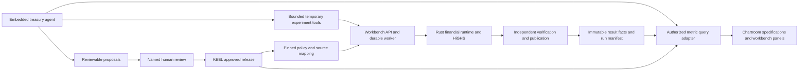

# Metrics engine integration and embedded agents

Assessment date: October 1, 2026. Rates Workbench was reviewed in its current,
modified local checkout. Metrics Definition Layer / KEEL / Chartroom was reviewed
at `beauschwab/metrics-engine-`, commit
`0b37ebf3b9984e23c257636eef63da9da6af0782` on `main`.
This is a source-based architecture assessment. No application, numerical suite,
live agent, warehouse connection, or integration benchmark was executed.

## Recommendation

Integrate the projects. KEEL supplies governed definitions, effective dates,
reviewed releases, lineage, monitoring and reusable consumption contracts.
Rates Workbench supplies financial modeling, scenario calculations, strategy
coefficients, validated optimization and journal-verified accounting. Together
they can support a treasury decision from its governing definition through its
modeled result to the evidence a committee reviews.

Begin with completed-run reporting and an embedded explanation agent. Extend
into temporary decision experiments after establishing run identity, access
control and compute budgets. Preserve the native financial runtime and the
existing synchronous coefficient evaluator.

The strongest product proposition is: **a governed treasury decision workbench
where every displayed result and proposed action has a reproducible basis**.
The integration also benefits KEEL: it can consume actual modeled scenarios
instead of relying on illustrative stress multipliers in its sample definitions.

## What already exists

| Capability | Rates Workbench | Metrics engine project |
| --- | --- | --- |
| Financial calculation | Rust product/dependency/workflow runtime, C++ HiGHS, independent Python verification | Declarative classifications, parameters, aggregations, formulas and windows; SQL/Polars/PySpark compilation |
| Durable identity | Input revisions, frozen job requests, model identity, content-addressed Parquet, publication guards | Append-only definition revisions, effective ranges, immutable releases and promoted channels |
| Reporting | KPI, capital/FTP, cohort and daily accounting outputs; paged artifact access; optional Iceberg | Metric contracts, deterministic dashboard specifications, widgets, grid, data critique and committee deck generation |
| Governance | Explicit model assumptions and independent publication checks; service-level attribution | Human definition review, control-change assessment, dashboard promotion, agent refusal at approval routes |
| Agent interface | Packaged operator instructions; no embedded agent runtime found in the reviewed API/web paths | Registry MCP, Chartroom MCP, grid MCP and a Python LangGraph/deepagents runtime with persistent conversations |

These are complementary forms of computation. A semantic definition does not
replace behavioral cashflow generation, fixed-OAS repricing or daily accounting.
Conversely, a validated pricer does not supply a definition promotion process,
effective-dated business policy or reusable dashboard contract.

## Where integration pays off

| Product area | Concrete integration | Value and priority |
| --- | --- | --- |
| Morning Sheet and KPIs | Bind native results to versioned metric identities, governed limits, source dates and approved reporting specifications | Highest initial value; makes the opening decision surface traceable |
| Capital & FTP | Govern GL mappings, supplied requirements, entity/scenario policy, FTP curves and explicit assumptions; pin their release into treasury jobs | High value; this feature already separates supplied policy from native arithmetic |
| Run monitoring | Apply variance monitors to comparable completed-run facts, with separate controls for historical closes and scenario experiments | High value once enough comparable history exists |
| Positions and cohorts | Host the reusable grid over authorized immutable tables; attach loan/cohort lineage, server paging and metric-specific totals | High usability value; requires a richer query adapter than current offset/limit paging |
| Decision Lab | Resolve governed constraints into existing typed options and prepared capital limits; attach metric/policy identity to session evidence | High strategic value, medium implementation complexity |
| ALCO packs | Reuse Chartroom's declarative dashboard and deterministic deck pipeline over frozen workbench run results | Strong downstream value; charts and committee numbers share the same source |
| Intake and classification | Use source bindings and prepared sources to normalize source vocabulary and govern grouping/mapping rules | Useful where source attributes exist; cannot manufacture insurance, encumbrance or regulatory eligibility |
| Native pricing and live allocation | Keep current execution ownership; consume governed configuration only at controlled preparation boundaries | A full semantic-engine rewrite here has poor initial payoff and risks numerical/performance contracts |

Capital/FTP policy governance is especially natural. The existing bridge accepts
verified closing balances or captured cashflows and deliberately leaves unknown
regulatory inputs unfilled. A definition agent can propose mappings and expose
their coverage; a reviewed release can provide policy. Rust continues to
calculate the resulting ratios and transfers. A registry citation or approval
does not validate eligibility, weights or a financial model empirically.

The daily FR 2052a reference pipeline is a separate opportunity. It needs real
regulatory source fields and filing validation beyond this research book.
Projecting scenario cashflows does not itself produce a regulatory filing.

## Recommended architecture

Use three clear authorities: the workbench owns saved books and financial
execution; KEEL owns definitions and their releases; Chartroom owns dashboard
specifications and presentation governance. Reference each other's immutable
identities. Do not synchronize two independently editable copies of a book or
policy, and do not merge the projects' databases as the first integration step.

The first bridge should be one adapter at the existing Chartroom
`QueryExecutor` boundary. It resolves allowlisted metrics against authorized,
completed workbench results and returns the established scalar/group/series
shapes. Alternatively, normalize workbench output into immutable fact tables
and run KEEL's compiled semantic plans over them. These are implementation
options; neither adapter exists today.

For native authoritative scalar outputs, register and serve the exact result.
For additional business rollups over additive result components, compile the
approved semantic definition. Avoid creating a second competing implementation
of native LCR, capital or scenario pricing during the pilot. If a future metric
needs a new model-produced primitive, extend the financial engine through its
normal recipe and expose the resulting immutable field.

Current `/jobs/{id}/manifest`, `/table` and `/parquet` routes provide the first
integration seam. Paging alone does not implement the grid's sorting, filtering,
grouping and totals contract: those require a bounded server query layer over
authorized artifacts. Large journals must remain partitioned. An Iceberg path
can later consume complete publication receipts; its individual table commits
must not be treated as an atomically complete multi-table run.

Every query and cache entry should carry or resolve:

- Workspace, authorized principal and metric reference/revision.
- Definition release hash, policy hash and source mapping revision.
- Source job/result hash, input revision and native model identity.
- Valuation date, source vintage, scenario, horizon and calculation basis.
- Unit/scale, aggregation behavior, method, model limitations and availability.

Distinguish definition lineage from numerical dependency identity. Link a metric
to the native run and its artifacts; do not reproduce Rust's pricing/cache graph
in a second semantic dependency manager.

## Important compatibility gaps

1. **Illustrative scenarios need real outputs.** KEEL's sample `irrbb_eve`
   computes stressed EVE using fixed asset/liability multipliers (`0.9412` and
   `0.9689`). Its sample liquidity view also contains fixed stress/buffer
   multipliers. Register separate modeled-scenario metrics from workbench
   outputs, with explicit method and scenario identity. The current workbench
   KPI EVE sensitivity is itself first-order DV01; nonlinear scenario results
   must be labeled separately. Never silently replace either method.
2. **Units need semantic metadata.** KEEL percentage values are percentage
   numbers. Workbench solver limits use decimals (`1.10` for a 110% LCR floor),
   while existing KPI output fields already use percentage numbers. Treasury
   amounts use absolute currency units and ledger bridges accept an explicit
   multiplier. Define conversion at each boundary; do not multiply every ratio
   by 100. Distinguish currency/bp DV01, rate bp and percentage-point changes.
3. **Reproducibility needs more than a metric pin.** The warehouse executor
   currently refuses older definition revisions. Its request wire also does not
   transport the reader's complete as-of/comparison context. The fixture query
   path resolves an unknown requested date to the latest fixture date. A
   historical treasury review needs the exact definition, source run and date;
   extend this path or serve pinned result facts without latest-date fallback.
4. **Model values and filed amounts have different precision contracts.** KEEL
   quantizes monetary filing values to minor units; its warehouse manifest
   deliberately removes some presentation rounding. Preserve native analytical
   precision and reduction tolerances. Make filing quantization an explicit
   separate output operation, with reconciliation evidence.
5. **Ratios and horizons need correct aggregation.** Sum permitted additive
   components, then derive a ratio; never sum or average capital ratios/RAROC
   indiscriminately. Stock metrics cannot be summed across valuation dates.
   Separate reporting date from projected horizon, and disclose the workbench's
   30-day reporting-month convention. Keep external NII distinct from internal
   FTP transfers; conditioned forecast paths remain income-only.
6. **Governance must reach the solver.** Existing capital limits require
   prepared unit identities and refresh after dirty edits. An arbitrary YAML
   metric is not automatically an LP constraint. Admit only known constraints
   and proven affine coefficients; new nonlinear/path-dependent metrics need
   an engine recipe, post-solve evaluation or an appropriate solver extension.
7. **Identity is an integration prerequisite.** Workbench has a workspace
   service-token gate and service attribution, not end-user RBAC. The reviewed
   agent runtime loads a principal from process configuration and accepts a
   conversation ID from the body. A shared deployment needs server-resolved
   user/workspace scope, conversation ownership and authenticated principal
   propagation before exposing client data or mutation tools.

## Embedded agent capabilities

Reuse the existing `Surface` abstraction with a new treasury surface, bounded
domain tools and the existing event protocol. A common conversation runtime can
serve distinct journeys for definition authoring, dashboard composition and
treasury analysis. The runtime currently chooses one surface per process; a
combined surface requires explicit tool composition and permissions. Grid MCP
tools exist separately and are not automatically part of the Chartroom loop.

| Journey | What the agent does | Deterministic evidence and limit |
| --- | --- | --- |
| Explain this number | Resolves definition, run, method, governing threshold and contributing breakdown | Cite artifact/query coordinates for each numeric claim; identify unavailable breakdowns |
| Explain what changed | Compares two compatible runs, checks changed books/markets/policies/models, narrates established attribution | A changed input alone does not prove causality; run controlled experiments when needed |
| Explore an action | Drafts temporary assumption/constraint edits, queues bounded experiments, compares independently replayed outcomes | Rust owns repricing and HiGHS; infeasibility is a valid result; limits and funding remain explicit |
| Prepare a policy change | Proposes classifications, capital/FTP mappings or monitors and shows coverage/control impact | Unknown regulatory fields stay unknown; definition save/release/approval remains a named human act |
| Investigate an exception | Reads deterministic monitor breaches and drills into authorized component facts | Monitor history must have comparable dates, sources and model/policy versions |
| Prepare the committee review | Composes a dashboard from an approved specification and a run-pinned decision memo/deck | Reporting certification is separate from model validation and saved-book acceptance |

Example first question: "Why did LCR headroom fall between these two closes?"
The agent retrieves compatible run and policy identities, obtains numerator and
denominator evidence, checks the variance control and explains only supported
contributions. If it cannot distinguish market changes from deposit changes,
it says what is missing and proposes a controlled temporary comparison.

Example later question: "Find an allocation that improves worst-case NII while
keeping our approved liquidity and capital floors." The agent resolves those
floors, checks current library/session identity, prepares an experiment, queues
the existing decision update, and compares the validated result. Reporting
feasibility is coefficient feasibility; accepting the strategy for ledger use
still requires the existing mapping, daily replay and publication gates.

Suggested new tools are `get_run_context`, `read_metric`, `get_metric_breakdown`,
`compare_runs`, `propose_experiment`, `submit_experiment`, `get_experiment`,
`cancel_experiment` and `get_decision_evidence`. These names describe proposed
contracts, not implemented endpoints. Delegate metric/definition reads to
existing tools where possible. Keep saved-book replacement and policy approval
outside the analysis tool roster.

Compute submission should return a durable workbench job ID promptly. Resuming
the conversation reattaches to that ID with the same idempotency key; it must
not resubmit expensive work. Conversation checkpoints and numerical jobs have
different owners. LangGraph's [persistence documentation](https://docs.langchain.com/oss/python/langgraph/persistence)
supports keeping thread state separately from cross-thread application state.
MCP's [Tasks extension](https://tasks.extensions.modelcontextprotocol.io/specification/draft/tasks)
can represent polling over an external job API where negotiated; ordinary
submit/status tools remain sufficient for the first bridge.

Add turn/tool-call/time/cost budgets, per-workspace experiment admission and
explicit cancellation mapping. The current agent module has a token cap but
no model timeout configured; it does not establish a treasury experiment
budget. Keep model/provider configuration replaceable. Validate numeric claims
against tool results, and expose stale/unavailable evidence without converting
it into reassuring prose. The core workbench should continue operating when
the model, registry or dashboard composition service is unavailable.

## Delivery sequence and acceptance

1. **Prove one completed-run bridge.** Normalize or directly expose LCR,
   NSFR, NII, method-specific EVE and selected capital/FTP metrics. Preserve
   immutable source identity, availability and model precision. Register their
   contracts and compare displayed values to original outputs.
2. **Build one governed Morning Sheet.** Reuse reviewed widgets/grid and
   approved threshold semantics. Pin the report to a run and definition
   release. Display research scope and the relevant date/method assumptions.
3. **Add the explanation agent.** Reuse the runtime with a treasury tool
   roster. Bind every conversation to its user/workspace and current report
   context. Test supported answers, missing data, stale runs and forbidden acts.
4. **Add bounded Decision Lab experiments.** Use existing durable session
   build/update/eval routes and native replay. Prove retry deduplication,
   cancellation, stale-policy/library refusal and numerical consistency.
5. **Deepen policy integration and history.** Govern capital/FTP mappings and
   supported constraint definitions, add comparable-close monitoring, then
   committee packs and optional warehouse/Iceberg consumption.

Pilot acceptance: a reader can follow a displayed number to its exact run,
definition and source inputs; a grouping reconciles when the metric is additive;
an agent explanation cites available evidence; a missing denominator remains
unavailable; a model/service outage preserves normal numerical operation; a
retry creates one experiment; an agent cannot approve/publish a policy or alter
the saved book; and interactive coefficient evaluation retains its existing
performance contract. Add temporal/pinned-revision, unit conversion, policy
refresh, large-table and cross-user tests at the adapter boundary.

Do not start by porting KEEL into Rust, replacing the pricing runtime, merging
all service databases, or moving heavy pricing into synchronous UI queries.
The first successful result should be a useful governed report and an agent
that can explain it from reproducible evidence.

## Source map

Workbench sources reviewed:

- [API ownership contracts](../../apps/api/AGENTS.md), [durable storage](../production-storage.md), [manifest/table routes](../../apps/api/app/main.py), [bounded reporting](../../apps/api/app/reporting.py).
- [Morning Sheet](../../apps/web/src/pages/MorningSheet.tsx), [workspace panels](../../apps/web/src/workspace/panels.tsx), [typed options](../../apps/api/app/schemas.py).
- [Capital/FTP scope](../capital-and-ftp.md), [source bridge](../../apps/api/app/treasury_store.py), [decision coordination and replay](../../packages/portfolio-risk/src/portfolio_risk/strategy/decision.py).

Metrics project sources, pinned to the reviewed commit:

- [Product contracts](https://github.com/beauschwab/metrics-engine-/blob/0b37ebf3b9984e23c257636eef63da9da6af0782/product.md), [runtime consumption](https://github.com/beauschwab/metrics-engine-/blob/0b37ebf3b9984e23c257636eef63da9da6af0782/packages/registry/clients/README.md).
- [Sample definitions](https://github.com/beauschwab/metrics-engine-/blob/0b37ebf3b9984e23c257636eef63da9da6af0782/packages/engine/documents.ts), [monetary quantization](https://github.com/beauschwab/metrics-engine-/blob/0b37ebf3b9984e23c257636eef63da9da6af0782/packages/engine/money.ts).
- [Query adapter seam](https://github.com/beauschwab/metrics-engine-/blob/0b37ebf3b9984e23c257636eef63da9da6af0782/apps/chartroom-api/src/query.ts), [warehouse restrictions](https://github.com/beauschwab/metrics-engine-/blob/0b37ebf3b9984e23c257636eef63da9da6af0782/apps/chartroom-api/src/executor.ts), [metric contracts](https://github.com/beauschwab/metrics-engine-/blob/0b37ebf3b9984e23c257636eef63da9da6af0782/packages/chartroom-spec/src/contracts.ts).
- [Agent surfaces](https://github.com/beauschwab/metrics-engine-/blob/0b37ebf3b9984e23c257636eef63da9da6af0782/apps/chartroom-agent/src/chartroom_agent/surfaces.py), [runtime and conversation identity](https://github.com/beauschwab/metrics-engine-/blob/0b37ebf3b9984e23c257636eef63da9da6af0782/apps/chartroom-agent/src/chartroom_agent/app.py), [agent loop](https://github.com/beauschwab/metrics-engine-/blob/0b37ebf3b9984e23c257636eef63da9da6af0782/apps/chartroom-agent/src/chartroom_agent/agent.py), [registry tools](https://github.com/beauschwab/metrics-engine-/blob/0b37ebf3b9984e23c257636eef63da9da6af0782/apps/registry-mcp/tools.ts).
- [Grid data seam](https://github.com/beauschwab/metrics-engine-/blob/0b37ebf3b9984e23c257636eef63da9da6af0782/packages/chartroom-grid/src/data/source.ts), [grid MCP](https://github.com/beauschwab/metrics-engine-/blob/0b37ebf3b9984e23c257636eef63da9da6af0782/packages/chartroom-grid/src/agent/server.ts), [daily liquidity pipeline](https://github.com/beauschwab/metrics-engine-/blob/0b37ebf3b9984e23c257636eef63da9da6af0782/pipelines/liquidity/README.md).
